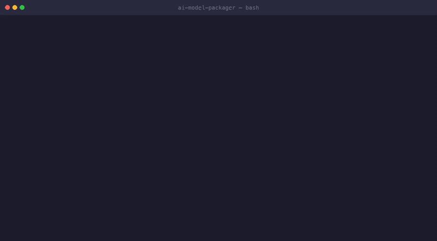

# AI Model Packaging Library

[](https://github.com/imjbassi/ai-model-packager/actions/workflows/ci.yml)
[](https://www.python.org/)
[](LICENSE)

## Overview

This repository contains the **AI Model Packaging Library**, developed as part of the **Capstone Project (Milestone 5) for the Master of Science in Software Engineering** at **Grand Canyon University (GCU)**.

The project delivers a **command-line interface (CLI) tool** that automates the process of packaging machine learning models into deployable **Docker containers** — eliminating the need for manual containerization and DevOps expertise. When Docker is unavailable, the same command produces a portable Python package instead.

---

## Demo



*One command turns a trained model into a deployable artifact. When Docker isn't available, the tool automatically falls back to a portable Python package. ([Watch the MP4](assets/demo.mp4))*

---

## Project Purpose

The AI Model Packaging Library addresses a **common challenge in machine learning workflows**: deploying trained models into production.

Traditionally, this requires:

* Manual creation of Dockerfiles
* Dependency management for different frameworks
* Model and inference script integration
* Knowledge of Docker, containerization, and DevOps pipelines

This tool solves those problems by offering a **single command** that packages any supported ML model into a fully deployable artifact.

---

## Key Features

* **Model auto-detection** across four formats — PyTorch, TensorFlow/Keras, ONNX, and scikit-learn
* **Per-framework dependency resolution** — a PyTorch image never ships TensorFlow, keeping images as small as the model requires
* **Automated Dockerization** — generates the Dockerfile, requirements, build context, and image
* **Hardened images** — pinned slim base image, non-root runtime user, and a generated `.dockerignore`
* **Isolated builds** — the build context is assembled in a temporary directory, so no stale files leak between runs (use `--keep-context` to inspect it)
* **Docker-free fallback** — produces a self-contained Python package with `run.py`, `run.sh`, and `run.bat` launchers
* **Cross-platform builds** — `--platform linux/amd64` for building images for a different architecture
* **Machine-readable output** — `--json` predictions for downstream tooling
* **Meaningful exit codes** — `0` success, `1` failure, `130` user cancellation
* **Tested** — a pytest suite plus CI across Python 3.9, 3.11 and 3.12

### Supported Formats

| Framework | Extensions | Container dependencies |
| --- | --- | --- |
| PyTorch | `.pth`, `.pt` | `torch`, `torchvision` |
| TensorFlow / Keras | `.h5`, `.keras` | `tensorflow` |
| ONNX | `.onnx` | `onnxruntime` |
| scikit-learn / joblib | `.joblib`, `.pkl` | `scikit-learn`, `joblib` |

---

## Repository Structure

```
ai-model-packager/
├── cli.py                  # Main CLI entry point
├── formats.py              # Format registry: extensions -> framework -> dependencies
├── docker_packager.py      # Build-context assembly and Docker image build
├── package_python.py       # Portable Python-package fallback (no Docker)
├── model_loader.py         # Framework-agnostic model loading
├── infer.py                # Inference script (runs in the container or locally)
├── final_demo.py           # Read-only project walkthrough
├── models/
│   └── gen_real_model.py   # Generates a real pretrained model (+ optional ONNX export)
├── tests/                  # pytest suite
├── .github/workflows/ci.yml
├── assets/                 # Demo GIF and MP4
├── pyproject.toml          # Packaging metadata and optional extras
├── requirements.txt        # Local development dependencies
├── LICENSE                 # MIT License
└── README.md               # This file
```

---

## Installation & Setup

### Prerequisites

* Python 3.9 or higher
* Docker Desktop or Docker Engine (optional — without it the tool falls back to Python packaging)
* Git (for cloning the repository)

### 1. Clone the repository

```bash
git clone https://github.com/imjbassi/ai-model-packager.git
cd ai-model-packager
```

### 2. Install dependencies

```bash
pip install -r requirements.txt
```

Or install the CLI itself, pulling in only the framework you need:

```bash
pip install -e ".[pytorch]"    # or .[tensorflow] / .[onnx] / .[sklearn] / .[dev]
```

Installing the package also provides an `ai-model-packager` command equivalent to `python cli.py`.

### 3. Generate a sample model

```bash
python models/gen_real_model.py
```

This creates `resnet18_full.pth` in the project root. Add `--onnx` to also export `resnet18_full.onnx`, or `--arch mobilenet_v2` for a smaller model.

### 4. Package the model into a Docker image

```bash
python cli.py --input resnet18_full.pth --image my_ai_model:1.0
```

### 5. Run inference inside the container

```bash
docker run --rm my_ai_model:1.0
```

To run against your own image, mount it and override the default arguments:

```bash
docker run --rm -v "$PWD:/data" my_ai_model:1.0 --test-input /data/your_image.jpg --top-k 3
```

---

## Usage

### Basic command

```bash
python cli.py --input <model_file> --image <image_name:tag>
```

### Arguments

| Argument | Description |
| --- | --- |
| `--input`, `-i` | Path to the model file (see supported formats above) |
| `--image`, `-t` | Docker image name and tag, e.g. `my_model:1.0` (also names the Python package) |
| `--mode` | `auto` (default): Docker when available, else Python package. `docker`: require Docker. `python`: skip Docker |
| `--output-dir`, `-o` | Where to write the Python package (default: `.`) |
| `--python-version` | Python version for the container base image (default: `3.11`) |
| `--platform` | Target platform for the build, e.g. `linux/amd64` |
| `--no-cache` | Build the image without the Docker layer cache |
| `--keep-context` | Keep the generated `build_context/` directory for inspection |
| `--version` | Print the tool version |

### Examples

```bash
# Standard Docker build
python cli.py -i resnet18_full.pth -t resnet_inference:latest

# ONNX model, built for x86 from an ARM machine
python cli.py -i model.onnx -t onnx_model:1.0 --platform linux/amd64

# No Docker: produce a portable package under dist/
python cli.py -i model.h5 -t tf_model:1.0 --mode python -o dist/

# Inspect exactly what would be built
python cli.py -i model.pth -t my_model:1.0 --keep-context
```

### Running inference directly

```bash
python infer.py --model resnet18_full.pth --test-input sample.jpg --top-k 3
python infer.py --model resnet18_full.pth --labels imagenet_classes.txt --json
```

---

## Example Output

### Building a Docker image

```
Checking Docker daemon availability...
SUCCESS: Docker daemon is running and responsive
Creating Docker build context in: /tmp/ai_model_packager_ab12cd
Building Docker image: my_ai_model:1.0
============================================================
...
============================================================
SUCCESS: built Docker image: my_ai_model:1.0
VERIFIED: image my_ai_model:1.0 exists and is ready to use
```

### Running inference

```
Processing image: sample.jpg

Top 5 predictions:
   1. Class 741: 0.0720 (7.2%)
   2. Class 539: 0.0510 (5.1%)
   3. Class 735: 0.0430 (4.3%)
   4. Class 604: 0.0380 (3.8%)
   5. Class 892: 0.0290 (2.9%)
```

---

## Testing

```bash
pip install -e ".[dev]"
pytest
```

The suite covers format detection, build-context generation, image-name validation, the Python-package fallback, prediction ranking, and CLI exit codes. Tests that need a framework (`torch`, `joblib`) skip automatically when it is not installed.

---

## Security Considerations

* Generated images run as a **non-root user** (`appuser`, UID 10001)
* Uses **Docker container isolation** to constrain the packaged model
* All dependencies are installed from **trusted package sources** (PyPI)
* Encourages use of **private container registries** for sensitive or proprietary models
* **Note:** loading a PyTorch `.pth` file executes pickled code. Only package models from sources you trust — `model_loader.load_model()` accepts `weights_only=True` for state-dict-only files
* **Recommendation:** scan images with Docker Scout or Trivy before deployment

---

## Troubleshooting

### Docker build fails

* Ensure Docker is running: `docker ps`
* Check Docker daemon logs for errors
* Verify sufficient disk space for image layers
* Retry with `--no-cache` if a cached layer is stale

### Model file not found

* Confirm the model file path is correct
* Ensure the model was generated successfully using `models/gen_real_model.py`

### Unsupported model format

* Check the extension against the supported-formats table above
* Registering a new framework means adding one entry to `formats.py` and one branch to `model_loader.py`

### Permission errors

* On Linux/macOS, you may need to run Docker commands with `sudo` or add your user to the `docker` group

---

## Future Enhancements

* Support for additional frameworks (XGBoost, LightGBM, safetensors)
* Integration with cloud deployment platforms (AWS, Azure, GCP)
* Automated model versioning and registry management
* REST API wrapper generation for containerized models
* Multi-architecture manifests via `docker buildx`

---

## References

Amazon Web Services. (2024). *Amazon Elastic Container Service documentation*. https://docs.aws.amazon.com/AmazonECS/latest/developerguide/Welcome.html

Docker, Inc. (2024). *Docker overview*. https://docs.docker.com/get-started/overview/

Goodfellow, I., Bengio, Y., & Courville, A. (2016). *Deep learning*. MIT Press.

Paszke, A., et al. (2019). PyTorch: An imperative style, high-performance deep learning library. *NeurIPS 2019*. https://doi.org/10.48550/arXiv.1912.01703

Red Hat. (2023). *Introduction to containers, Kubernetes, and Red Hat OpenShift*. https://www.redhat.com/en/topics/containers

---

## Academic Information

This project was developed as part of the **Master's Capstone in Software Engineering** at **Grand Canyon University**. It demonstrates proficiency in **software engineering principles, DevOps integration, and applied machine learning deployment**.

**Author**: Imjot Bassi
**Institution**: Grand Canyon University
**Program**: Master of Science in Software Engineering
**Project**: Capstone Milestone 5

---

## Contributing

Contributions are welcome! Please follow these guidelines:

1. Fork the repository
2. Create a feature branch (`git checkout -b feature/your-feature`)
3. Add or update tests and make sure `pytest` passes
4. Commit your changes (`git commit -m 'Add new feature'`)
5. Push to the branch (`git push origin feature/your-feature`)
6. Open a Pull Request

---

## License

This project is released under the **MIT License**. See the [LICENSE](LICENSE) file for full details.

---

## Contact

For questions, feedback, or collaboration opportunities:

* **GitHub**: [@imjbassi](https://github.com/imjbassi)
* **Repository**: [ai-model-packager](https://github.com/imjbassi/ai-model-packager)
